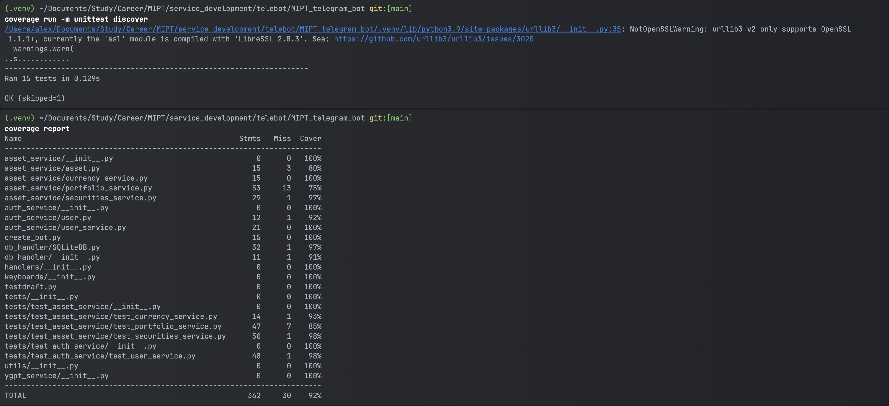

## Телеграм-бот - финансовый советник
<hr>
aiogram 3.13.1, SQLite3, request, Python 3.9.6

**Разработка бота продолжается**

### Настройка среды исполнения:
Настроить виртуальную среду (опционально) для локальной разработки. Создать:

`python -m venv .venv`

и активировать:

`
venv\Scripts\activate.bat` для Windows

`source venv/bin/activate` - для Linux и MacOS.

(Деактивировать:

`
venv\Scripts\deactivate` для Windows

`deactivate` - для Linux и MacOS.
)

Также среду и версию интерпретатора можно настроить с помощью настроек проекта в IDE

### Зависимости:
Установить зависимости можно с помощью файла requirements.txt. Локально установить зависимости можно с помощью:

`pip3 install -r requirements.txt`

Файл requirements.txt может иметь следующий вид:

```
aiogram
APScheduler
python-decouple
requests
asyncio
pydantic-settings
yfinance
```

Также, для генерации файла requirements.txt, можно воспользоваться библиотекой 
`pipreqs`, которая сформирует файл на основе кодовой базы проекта:

`pip install pipreqs`

`pipreqs, --force` для перезаписи существующего файла

Могут возникнуть проблемы с кодировкой, например если под сканирование попадает директория с виртуальной средой. 
В таком случае можно игнорировать директории или файлы. Также можно прямо указать кодировку:

`pipreqs . --encoding=iso-8859-1 --ignore ".venv"` 

Для вывода списка зависимостей просто в консоль:

`pipreqs . --encoding=iso-8859-1 --ignore ".venv" --print`

## Переменные окружения:
Для локального запуска необходимо подготовить файл .env с токенами проекта. Например, вида:

```
BOT_TOKEN=<токен бота от BotFather>
BOT_ADMINS=<telegram_id пользователя с правами админа>
BOT_DB_PATH=<Путь к БД>
DB_LOGIN=<Логин учетной записи для работы с БД>
DB_PASSWORD=<Пароль учетной записи для работы с БД>
YANDEX_OAUTH_TOKEN = <Токен учетной записи Яндекс>
YANDEX_FOLDER_ID = 'ID подключенного сервиса YnandexCloud'
YANDEX_AIM_TOKEN = 'https://iam.api.cloud.yandex.net/iam/v1/tokens'
YGPT_API_URL = "https://llm.api.cloud.yandex.net/foundationModels/v1/completion"
```

Для считывания переменных окружения можно использовать разные библиотеки. В данном проекте используется 
`python-decouple`

При запуске контейнера Docker переменные передаются через командную строку в случае использования `dotenv`, 
или передается path к файлу с переменными в других случаях

### Работа с базой данных:
В проекте используется база данных SQLite
Каталог для данных, БД и таблицы создаются автоматически при запуске приложения (с проверкой `IF EXISTS`)

Для работы приложения из контейнера на удаленный сервер необходимо перенести данные:

Файлы базы данных и токенов:

`% sudo scp -i /Path/to/.ssh/key_rsa /Path/to/target_file userename@host:/Path/to/dest`

### Контейнеризация:
**Создание образа:**

```
alex@iMac-IMAC ~ % sudo docker build --platform linux/amd64 -t aberezhnoy1980/mipt-chat-bot \
/Users/alex/Documents/Study/Career/MIPT/service_development/telebot/MIPT_telegram_bot
```
**Запуск контейнера:**

```
alex@iMac-IMAC MIPT_telegram_bot % sudo docker run -d -it \
--env-file /path/to/.env \
-v /Path/to/localhost/db/directory:/app/app_data \
--name main_container aberezhnoy1980/mipt-chat-bot
```

### CI:


Реализованы 
* сервис авторизации
* сервис взаимодействия с Московской биржей
* сервис взаимодействия с Центральным банком РФ
* Подключен YandexGPT
* Приложение покрыто тестами



В разработке: документирование проекта, перевод приложения с polling на webhooks, подключение ORM (SQLAlchemy, aiosqlite), CI/CD